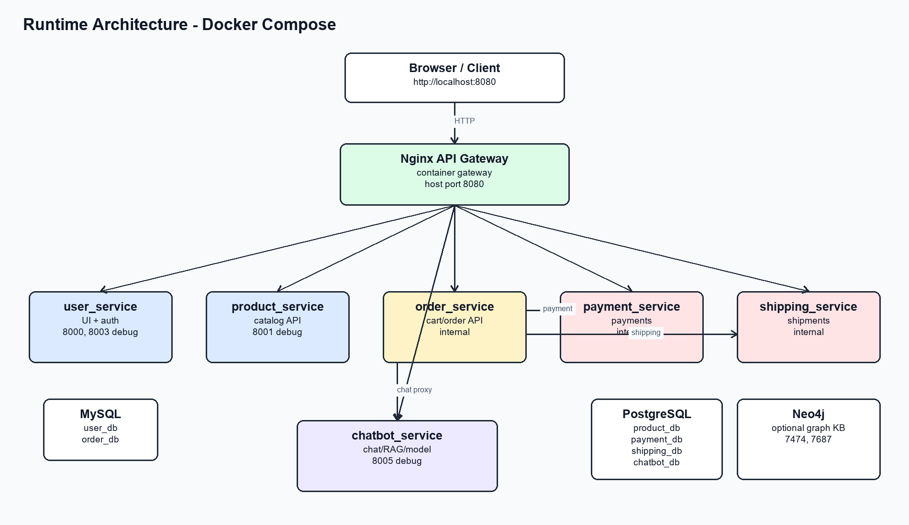
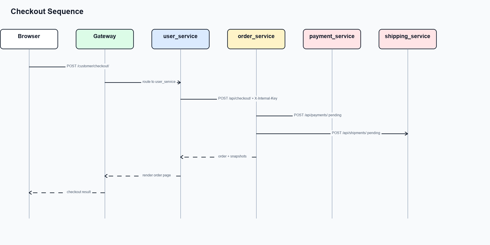
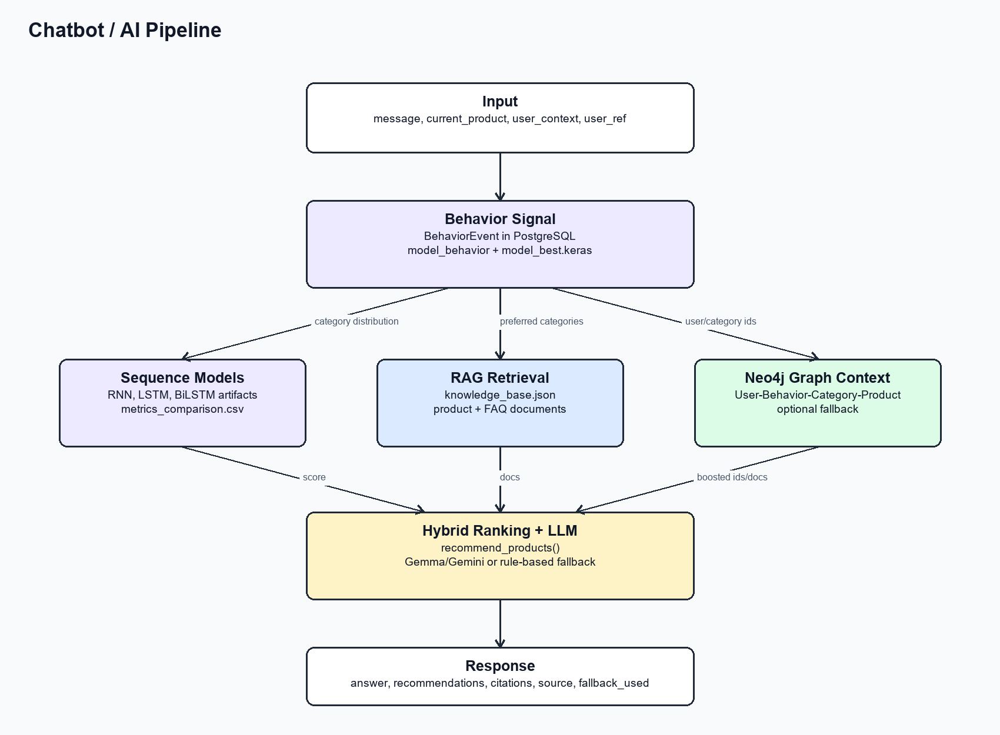
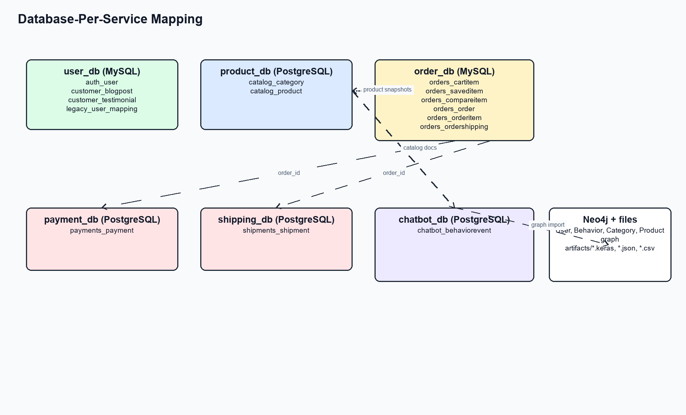

# 🎓 Báo Cáo Phân Tích & Thiết Kế Hệ Thống E-Commerce Microservices Tích Hợp AI Chatbot

> Tài liệu này cung cấp cái nhìn toàn diện về dự án từ khâu **Phân tích nghiệp vụ (BA)**, **Thiết kế kiến trúc hệ thống (System Architecture)**, cho đến **Quá trình triển khai & phát triển phần mềm (Software Development)**. Khẳng định sự kết hợp chặt chẽ giữa thiết kế hệ thống phân tán và ứng dụng trí tuệ nhân tạo (AI).

---

## 1. 🌟 Tổng Quan Dự Án & Bối Cảnh Nghiệp Vụ

Dự án xây dựng một nền tảng Thương mại điện tử (E-Commerce) nhằm giải quyết hai bài toán lớn trong ngành bán lẻ hiện đại:
1. **Mở rộng quy mô (Scalability) & Chịu tải**: Hệ thống Monolith truyền thống dễ bị thắt cổ chai khi lượng truy cập tăng đột biến. Giải pháp là chuyển đổi sang kiến trúc **Microservices**, cho phép scale độc lập từng chức năng (ví dụ: chia tách hệ thống Đặt hàng và hệ thống AI).
2. **Cá nhân hóa trải nghiệm (Personalization)**: Khách hàng thường choáng ngợp trước số lượng sản phẩm. Giải pháp là tích hợp **AI Assistant** (ứng dụng RAG & Knowledge Graph) để đóng vai trò tư vấn viên 24/7, gợi ý mua sắm theo đúng ngữ cảnh cá nhân của người dùng.

---

## 2. 🛠 Công Nghệ Sử Dụng (Tech Stack)

Hệ thống sử dụng đa dạng công nghệ để tối ưu hóa cho cả quy trình Quản lý Dự án/Phân tích Nghiệp vụ lẫn quá trình Phát triển Phần mềm:

### 2.1. Công Cụ Phân Tích & Quản Lý Dự Án (BA Tools)
- **Quản lý Task & Agile/Scrum**: Jira, Trello (Quản lý Epic, User Story, Backlog).
- **Mô hình hóa (UML & Diagrams)**: Visual Paradigm, Mermaid, Draw.io (Thiết kế Use Case, Sequence Diagram, Context Map).
- **Thiết kế & Prototype**: Figma (Wireframing cho Dashboard và Chat Widget).
- **Tài liệu & API Testing**: Confluence / Notion (Tài liệu Shared Contracts), Postman / Swagger (Kiểm thử API Gateway).

### 2.2. Công Nghệ Phát Triển (Development Stack)
- **Backend Services**: Python, Django 5.2, Django REST Framework (DRF).
- **API Gateway**: Nginx (Reverse Proxy & Request Routing).
- **Cơ sở dữ liệu (Polyglot Persistence)**: 
  - **MySQL**: Tối ưu cho User & Order Management.
  - **PostgreSQL**: Tối ưu cho Product Catalog, Payment, Shipping & Chatbot Event Logging.
  - **Neo4j**: Graph Database dành riêng cho AI Knowledge Graph (Sơ đồ hành vi & sở thích khách hàng).
- **AI & Machine Learning**: TensorFlow, Keras (Dự đoán danh mục), LLMs (Gemma/Gemini API).
- **Triển khai (Deployment)**: Docker, Docker Compose, Bash/PowerShell Scripts.

---

## 3. 📝 Phân Tích Yêu Cầu & Đặc Tả Nghiệp Vụ (Business Analysis)

Hệ thống được chia cắt thành 6 miền nghiệp vụ (Bounded Contexts) chính. Hoạt động của hệ thống được thiết kế phân chia rõ rệt thành hai mảng: **Trải nghiệm Khách hàng** và **Quản lý Vận hành & Dữ liệu**.

### Phần 1: Phân Tích Dành Cho Customer (Khách hàng)
- **Use Cases Cốt Lõi**: Đăng ký/Đăng nhập, Tìm kiếm sản phẩm, Trò chuyện với AI để xin tư vấn, Quản lý Giỏ hàng (Cart), Tiến hành thanh toán (Checkout), và Theo dõi vận đơn.
- **`US-01` (AI Integration)**: *Là Khách hàng, tôi muốn chat với AI Assistant ngay trên trang sản phẩm để hỏi xem laptop này có phù hợp cho lập trình không, từ đó tôi có thể ra quyết định mua nhanh hơn.*
- **`US-02` (Order Flow)**: *Là Khách hàng, khi thanh toán thành công, tôi muốn hệ thống tự động sinh mã vận đơn và thông báo trạng thái "Đã thanh toán" ngay lập tức để an tâm về giao dịch.*

### Phần 2: Phân Tích Dành Cho Admin/Staff (Nhân viên Quản trị)
- **Use Cases Cốt Lõi**: Quản lý kho sản phẩm (Catalog Management), Điều phối và xử lý đơn hàng (Order Fulfillment), Cập nhật trạng thái vận đơn, Ghi nhận báo cáo giao dịch (Payment Tracking) và Theo dõi hiệu suất AI.
- **Quản Lý Dữ Liệu Catalog**: Staff có quyền CRUD đối với Danh mục và Sản phẩm trên `product_service`. Dữ liệu này là "nguồn sống" cho file RAG Knowledge Base của AI. Việc thêm/sửa sản phẩm yêu cầu xác thực API chặt chẽ qua Header `X-Staff-Key`.
- **Quản Lý Vận Hành Đơn Hàng & Vận Chuyển**: 
  - Khi đơn hàng được thanh toán, Staff sử dụng Dashboard để lọc đơn hàng có trạng thái "Paid".
  - Staff đóng gói sản phẩm và truy cập vào `shipping_service` để khởi tạo Shipment, cập nhật trạng thái từ "Pending" sang "Shipped", đồng thời gắn mã vận chuyển (Tracking Code). Hệ thống sẽ tự động đồng bộ trạng thái về `order_service` để khách hàng có thể theo dõi.
- **`US-03` (Staff Operations)**: *Là Nhân viên Kho, tôi muốn lọc được danh sách các đơn hàng "Đã thanh toán" một cách độc lập để tiến hành xuất kho và tạo mã Vận chuyển mà không ảnh hưởng tới giỏ hàng của user.*

---

## 4. 📐 Kiến Trúc Hệ Thống & Microservices (System Architecture)

Dự án áp dụng triệt để kiến trúc Microservices với 6 dịch vụ độc lập, giao tiếp với nhau qua mạng nội bộ Docker và chỉ phơi bày endpoint ra ngoài thông qua một **API Gateway (Nginx)** duy nhất tại port `8080`.

1. **`user_service`**: Đóng vai trò là Orchestrator chính cho Web UI, quản lý Authentication (Session cho UI, JWT cho API). Gọi tới các service khác để lấy dữ liệu tổng hợp cho màn hình Dashboard.
2. **`product_service`**: Chứa Catalog (Danh mục, Sản phẩm). API cung cấp quyền Read cho Customer và quyền Write cho Staff.
3. **`order_service`**: Quản lý Giỏ hàng và luồng Checkout cốt lõi. Chứa logic gọi liên dịch vụ đến Payment và Shipping.
4. **`payment_service`**: Tách biệt logic giao dịch và trạng thái từ cổng thanh toán.
5. **`shipping_service`**: Độc lập theo dõi vòng đời vận đơn do Staff thao tác.
6. **`chatbot_service`**: Trung tâm AI xử lý nặng. Chứa RAG Knowledge Base, ML Model và Graph Engine.

---

## 5. 🔄 Luồng Hoạt Động & Xử Lý Nghiệp Vụ (Core Operation Flows)

Sự phức tạp của Microservices nằm ở việc điều phối (Orchestration) và giao tiếp giữa các services. Hệ thống xử lý các luồng cốt lõi sau:

### 5.1. Luồng Đặt Hàng & Checkout (Customer - Trải nghiệm mua sắm)
Khi khách hàng bấm "Tiến hành thanh toán", một chuỗi tác vụ phân tán diễn ra:
1. **User Service** nhận request từ UI, xác thực quyền và forward sang **Order Service**.
2. **Order Service** truy vấn dữ liệu sản phẩm từ **Product Service**. Hệ thống thực hiện hành vi **chụp lại (snapshot)** giá cả và tên sản phẩm để lưu cứng vào `OrderItem`.
3. **Order Service** ra lệnh khởi tạo giao dịch (Pending) tới **Payment Service**.
4. Đồng thời, gửi thông tin địa chỉ sang **Shipping Service** để tạo mã vận chuyển dự kiến.

### 5.2. Luồng Điều Phối Vận Đơn & Cập Nhật Dữ Luệu (Staff - Quản trị vận hành)
Đây là quy trình quản lý dữ liệu hậu kỳ sau khi khách mua hàng:
1. Staff truy cập `/staff/orders/` qua Nginx Gateway.
2. **User Service** kiểm tra Role (Staff) và lấy toàn bộ danh sách Order kèm trạng thái Payment & Shipping từ **Order Service**.
3. Staff xác nhận đã giao cho đơn vị vận chuyển và bấm cập nhật. Nginx điều hướng API gửi tín hiệu nội bộ đến **Shipping Service**.
4. **Shipping Service** ghi đè log trạng thái `ShipmentEvent` (từ Pending -> In_Transit) vào PostgreSQL. Trạng thái sau đó được đồng bộ (Sync) về **Order Service** để Customer thấy sự thay đổi, hoàn tất vòng lặp dữ liệu.

### 5.3. Luồng AI & Knowledge Graph (AI Consultation Pipeline)
Trợ lý AI không chỉ là một cái vỏ chat, mà là một quy trình tích hợp sâu vào Database:
1. **Event Ingestion**: Mọi thao tác (Xem hàng, Thêm giỏ, Đặt hàng) đều được đẩy ngầm về `chatbot_service` dưới dạng `BehaviorEvent`.
2. **Graph Update**: Các sự kiện này được ghi vào Neo4j (`User` -> `PREFERS` -> `Category`), vẽ ra sơ đồ tri thức về thói quen người dùng.
3. **Hybrid Retrieval (RAG)**: Khi user nhắn tin, luồng truy vấn sẽ quét qua file Catalog (RAG), quét Graph từ Neo4j, và chạy mô hình ML phân loại nhu cầu để tạo Context tổng hợp.
4. **LLM Generation**: LLM (Gemma/Gemini) sinh câu trả lời tự nhiên đi kèm với cấu trúc Product Card để render UI trực quan.

---

## 6. 🗄 Thiết Kế Dữ Liệu & Cách Xử Lý Ràng Buộc Phân Tán

Việc áp dụng **Database-per-service** đồng nghĩa với việc từ bỏ Khóa ngoại (Foreign Key - FK) truyền thống. Giải pháp xử lý:

- **Logical Association**: Các bảng trong `order_db` hay `payment_db` lưu `user_id` dưới dạng số nguyên (integer) đơn thuần. 
- **Data Snapshotting**: Luồng Giỏ hàng (`CartItem`) và Đơn hàng (`OrderItem`) sao chép toàn bộ thông tin quan trọng (`product_name`, `unit_price`, `brand`, `image_url`) từ `product_db` sang `order_db` tại thời điểm đó thay vì chỉ tham chiếu FK. **Lợi ích thực tế cho Staff:** Khi Staff sửa giá hoặc xóa sản phẩm trong tương lai trên `product_db`, lịch sử hóa đơn tài chính trên `order_db` vẫn giữ nguyên sự nguyên vẹn và không bị biến dạng.
- **Neo4j Graph**: Tận dụng cơ sở dữ liệu đồ thị để lưu các mối quan hệ đa chiều. Tránh JOIN chéo hàng chục bảng SQL phức tạp để lọc ra nhu cầu khách hàng.

---

## 7. 🎨 Thiết Kế UI/UX & Khả Năng Mở Rộng Giao Diện

- **Giao diện Mua sắm (Customer)**: Hỗ trợ hiển thị xen kẽ các "AI Suggestion Blocks" được cá nhân hóa cho từng User ID.
- **Giao diện Quản trị (Admin/Staff)**: Màn hình bảng điều khiển tối ưu hóa không gian dọc, liệt kê bảng dữ liệu (Datatables) đa luồng từ các Service khác nhau thông qua Gateway, giúp nhân viên không cần đăng nhập vào từng module rời rạc.
- **Widget AI Tương tác Tức thời**: Chat widget được thiết kế dạng Float Window. Khung chat hỗ trợ hiển thị tin nhắn Rich Text và **Product Carousel**, cho phép khách hàng bấm "Thêm vào giỏ" ngay trong khung trò chuyện.

---

## 8. ✅ Quy Trình Kiểm Thử, Triển Khai & Vận Hành (Ops/UAT)

- **Shared Contracts (Giao kèo nội bộ)**: Xác lập tài liệu cấu trúc dữ liệu chung (`docs/phase-1-shared-contract.md`) giữa team Backend và team AI. Đảm bảo schema của CSV, JSON và các Event Vocabulary là bất biến.
- **Triển khai Container hóa**: Toàn bộ kiến trúc được gói trong Docker. Hệ thống hỗ trợ khởi chạy `Zero-config` thông qua lệnh `docker compose up`. 
- **Kiểm thử nghiệm thu (UAT)**: Được thiết kế riêng biệt để đánh giá tính trọn vẹn:
  - Phân tách UAT cho Customer (Mô phỏng hành vi truy cập, mua sắm, nhận tư vấn AI).
  - Phân tách UAT cho Staff (Thử nghiệm đăng nhập quyền hạn, CRUD danh mục, và luồng chuyển đổi trạng thái giao hàng chéo service).
