# Mermaid Diagrams Cho Tieu Luan - Version 1

Tai lieu nay la ban Mermaid v1 cho tieu luan AI Service ecommerce. Ban v1 dung de dua vao report va review nhanh kien truc muc tieu. Version 2 co the ve lai bang Visual Paradigm hoac draw.io de co layout dep hon cho ban nop cuoi.

Pham vi cua ban v1:

- Phan anh yeu cau PDF: ecommerce tich hop AI Service, KB_Graph Neo4j, RAG/chat, goi y trong search/cart/chat.
- Phan anh repo hien tai: `nginx` gateway, `user_service`, `product_service`, `order_service`, `payment_service`, `shipping_service`, `chatbot_service`, MySQL, PostgreSQL, Neo4j.
- Phan anh kien truc muc tieu da cat xong: Nginx la entrypoint chinh, JWT API va session UI cung ton tai, payment/shipping da tach service rieng.
- Khong thay doi logic ung dung runtime.

Ghi chu hien trang: `order_service` van giu snapshot `payment_status`, `paid_at`, `shipping_status`, va shipping address de bao toan UI/order history, nhung ban ghi payment duoc tao/cap nhat trong `payment_service` va shipment duoc tao/cap nhat trong `shipping_service`.

## 1. System Architecture Diagram

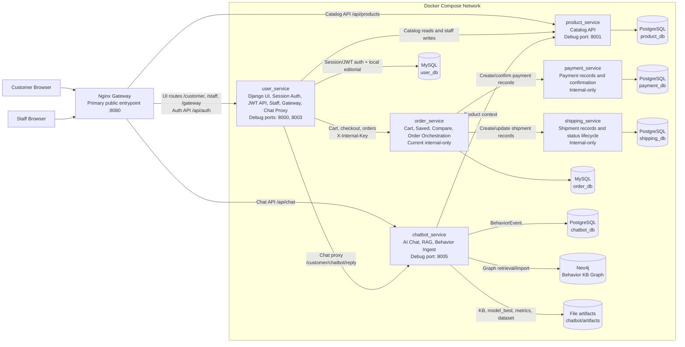

## 2. DDD Context Map

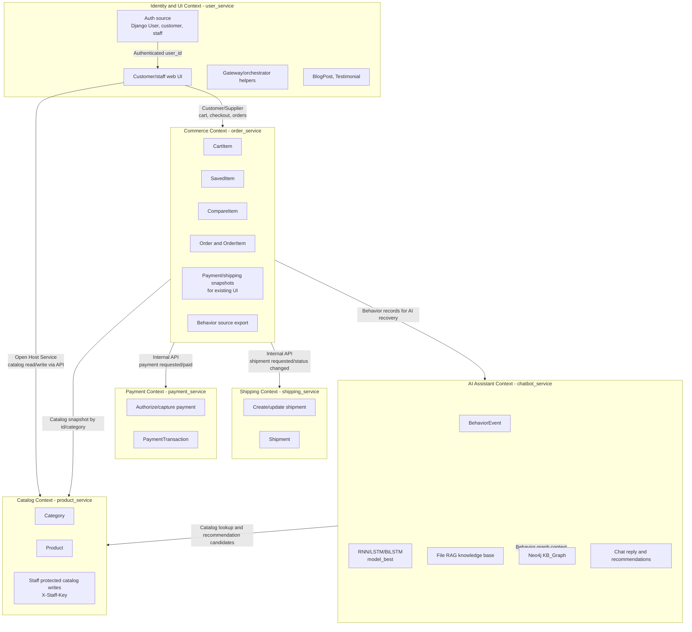

## 3. Class Diagram

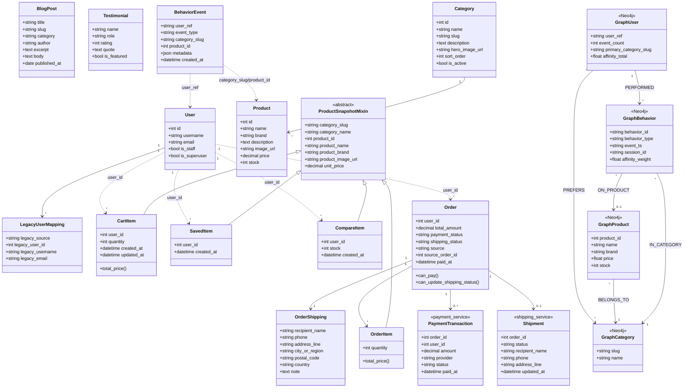

## 4. Sequence Diagram - Flow Mua Hang

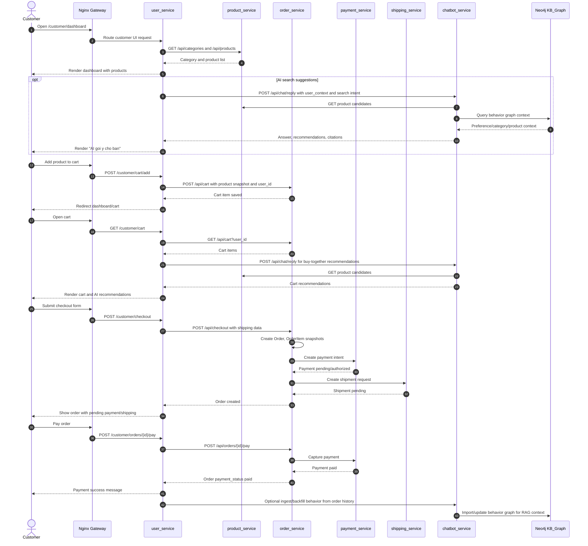

## 5. Database Mapping Theo Tung Service

### 5.1 Mapping Summary

| Service | Database | Runtime status | Main ownership |
|---|---|---|---|
| `user_service` | MySQL `user_db` | Current | Django auth user, customer/staff UI state, editorial content, legacy user mapping |
| `product_service` | PostgreSQL `product_db` | Current | Category and Product catalog |
| `order_service` | MySQL `order_db` | Current | Cart, saved, compare, order, order item snapshots, current payment/shipping statuses |
| `payment_service` | PostgreSQL `payment_db` | Current | Payment transaction and provider status; `order_service` keeps payment snapshots for UI compatibility |
| `shipping_service` | PostgreSQL `shipping_db` | Current | Shipment address/status lifecycle; `order_service` keeps shipping snapshots for UI compatibility |
| `chatbot_service` | PostgreSQL `chatbot_db` | Current | BehaviorEvent persistence |
| `chatbot_service` | Neo4j `neo4j` | Current optional | User/Behavior/Category/Product graph for KB_Graph and RAG context |
| `chatbot_service` | File artifacts | Current | `data_user500.csv`, sample 20 rows, metrics, model_best, RAG KB JSON, graph SVG |

### 5.2 user_service - MySQL user_db

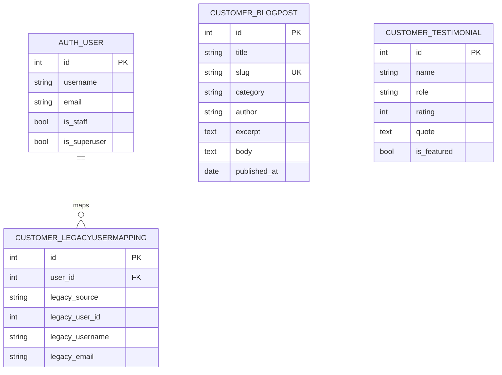

### 5.3 product_service - PostgreSQL product_db

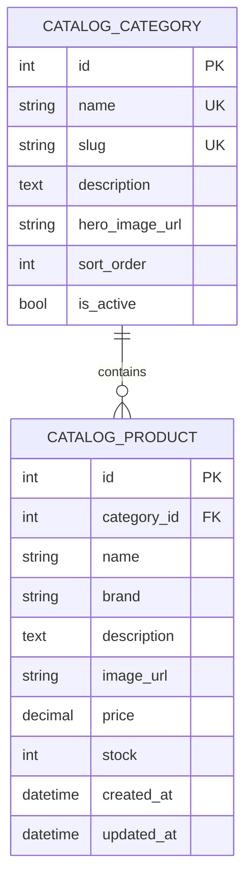

### 5.4 order_service - MySQL order_db

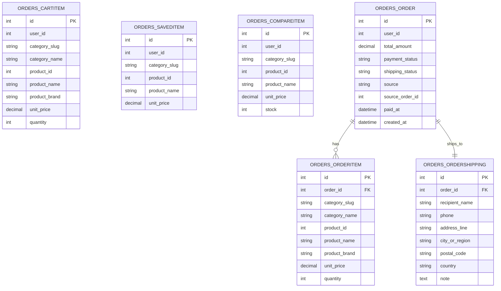

### 5.5 payment_service - PostgreSQL payment_db

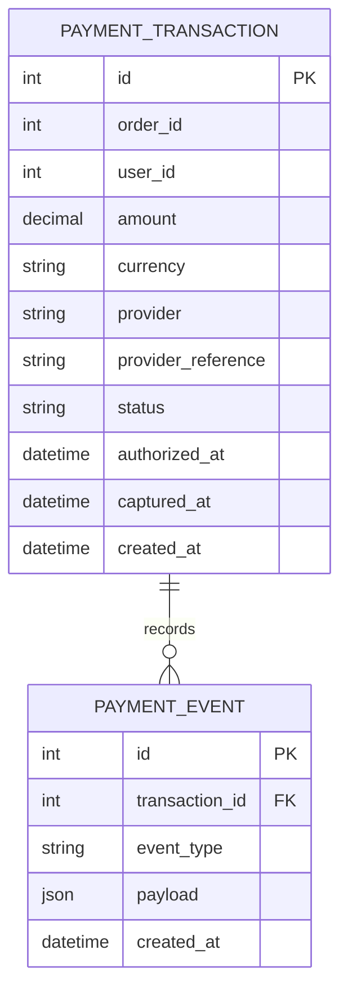

### 5.6 shipping_service - PostgreSQL shipping_db

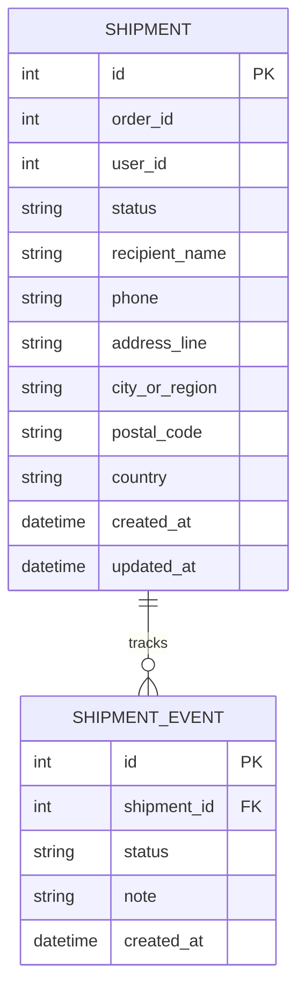

### 5.7 chatbot_service - PostgreSQL chatbot_db va Neo4j KB_Graph

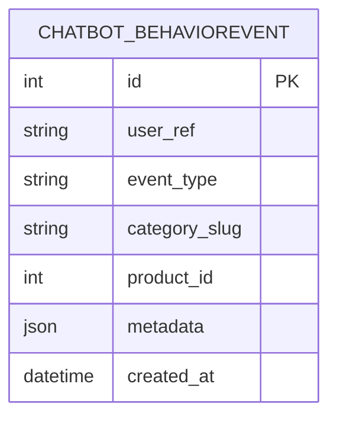

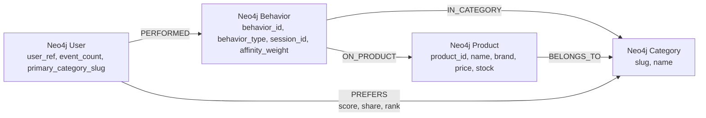

### 5.8 Runtime Data Flow Mapping

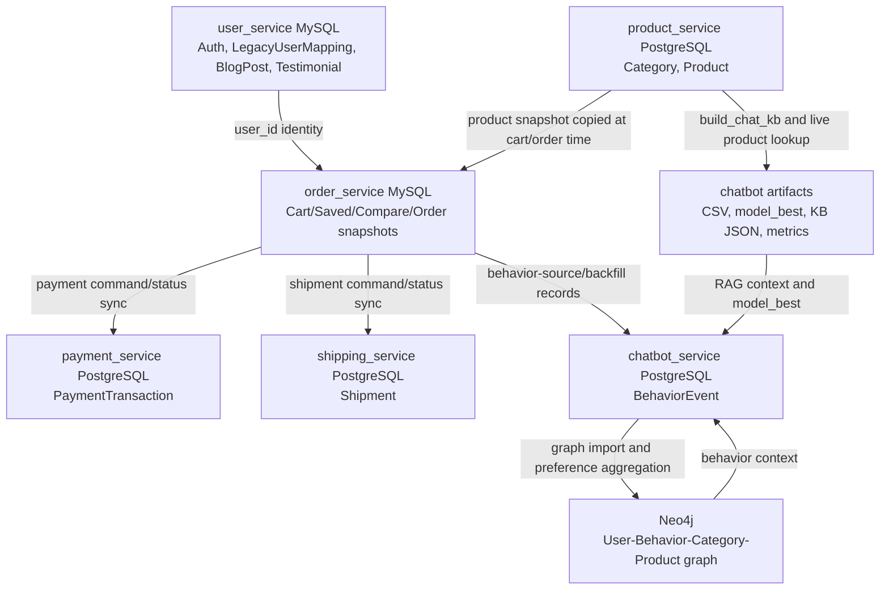
